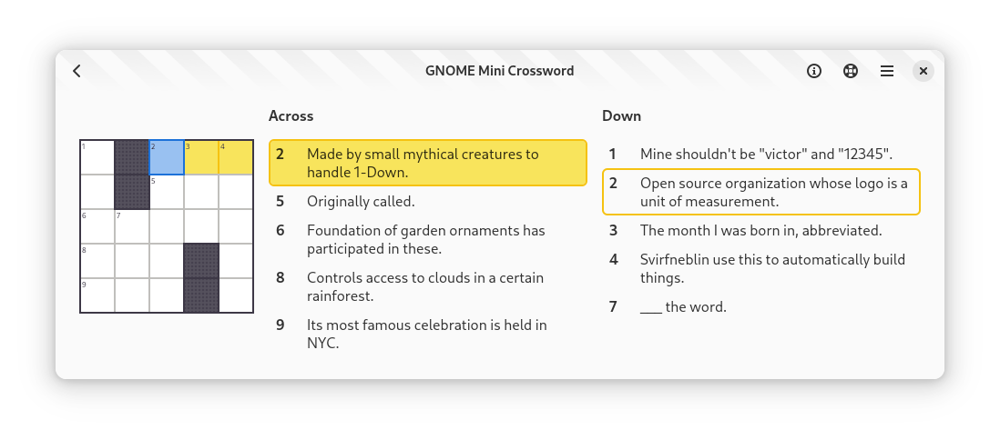

+++
title      = 'Introducing my GSoC 2025 project'
slug       = 'gsoc-introduction'
date       = '2025-05-15'
categories = ['GSoC']
+++

I will be contributing to GNOME Crosswords, as part of the Google Summer of Code 2025 program. My project adds construction aids to the Crosswords editor. These aids provide hints, warnings, and data that help the user create better crossword puzzles.

## GNOME Crosswords

The [GNOME Crosswords](https://gitlab.gnome.org/jrb/crosswords) project consists of two applications:
* The [Crosswords player](https://flathub.org/apps/org.gnome.Crosswords), which you can use to play crossword puzzles.
* The [Crosswords editor](https://flathub.org/apps/org.gnome.Crosswords.Editor), which you can use to create crossword puzzles.

If you would like to learn more about GNOME Crosswords, check out this [GUADEC presentation](https://www.youtube.com/watch?v=fcQfpQLLzYo) that Jonathan Blandford, the creator of Crosswords, gave last year.

## Crossword construction

Constructing a crossword puzzle is tricky. Constructing a *good* crossword puzzle is even trickier. The main difficulty lies in finding words to fill all the rows and columns.

Initially, it's quite easy, because the grid starts off completely empty; so you are not at all restricted in what words you pick. But as you add more and more words to the grid, it becomes harder and harder to fill in the remaining empty spots. That's because a remaining row, for example, will have a few of its cells already filled, due to the intersecting columns. It's possible that, halfway through the construction process, you realize that one or more row/column cannot be filled at all! In that case, you would need to backtrack and delete some of the intersecting words and try again.

And all that only gets you a valid crossword puzzle. To make a *good* crossword puzzle, there are many more things to consider. For example:

* Are the words interesting?
* Are there any words that are so uncommon as to feel unfair?
* Does the puzzle have a good variety of parts of speech?
* Is the grid rotationally symmetric?
* Are there any unchecked cells?

To learn more about the crossword construction process, check out [How to Make a Crossword Puzzle](https://www.nytimes.com/2018/09/14/crosswords/how-to-make-a-crossword-puzzle-the-series.html), from *The New York Times*, as well as [How to Create a Crossword Puzzle](https://www.youtube.com/watch?v=aAqQnXHd7qk), from *Wired*.

Suffice it to say, creating a good crossword puzzle is a daunting task. However,crossword construction software can make the process easier---certainly not easy---but easier. For example, the GNOME Crosswords editor gives you a list of possible words for each row/column, taking into account any cells in the row/column that are already filled with a letter.

The goal of my GSoC project is to add additional construction aids to the Crosswords editor. These aids will help the user to create better crossword puzzles.

## Construction aids

Here are some potential construction aids that this project could add:
* Warning for unches (unchecked cell).
* Warning for non-dictionary-words.
* Warning for words with low familiarity.
* Indicator for average familiarity of words.
* Warning for crosswordese (overused crossword words).
* Heat map for hard-to-fill cells.
* Parts-of-speech distribution graph.

Right now, we are in the community bonding period of the GSoC program (May 8 to June 1). During this time, I will work with my mentors to determine which construction aids this project should add.

## Mini crossword

Here is a GNOME-themed [mini crossword](https://drive.google.com/file/d/1IjSUo3j_GK_Lw-x5mhFfX3qRLDZN2TOf) that I made. You can try it out with the Crosswords player.

